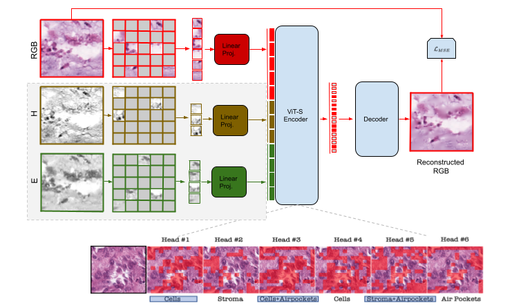

# MMAE_Pathology: Multi-modal Masked Autoencoders Learn Compositional Histopathological Representations

[`arXiv`](http://arxiv.org/abs/2209.01534) | [`BibTeX`](#citation)

<p align="center">

</p>

We introduce Multi-modal Masked Autoencoders (**MultiMAE**), an efficient and effective pre-training strategy for Vision Transformers
which extends [MultiMAE](https://github.com/EPFL-VILAB/MultiMAE). Given a smallset of unique random sample of visible patches from 
compositional stains of histopathology images, the MMAE pre-training objective is to reconstruct the masked-out regions.
Once pre-trained, a single MMAE encoder can then be used for downstream transfer.

## Catalog
- [x] MMAE pre-training code
- [x] Classification fine-tuning code


## Usage

### Set-up
See [SETUP.md](SETUP.md) for set-up instructions.

### Pre-training
See [PRETRAINING.md](PRETRAINING.md) for pre-training instructions.

### Fine-tuning
See [FINETUNING.md](DOWNSTREAM.md) for fine-tuning instructions.


## Acknowledgement
This repository is built using [Roman Bachmann](https://roman-bachmann.github.io/) and [David Mizrahi's](https://dmizrahi.com)'s library [MultiMAE](https://github.com/EPFL-VILAB/MultiMAE), [timm](https://github.com/rwightman/pytorch-image-models/tree/master/timm), [DeiT](https://github.com/facebookresearch/deit), [DINO](https://github.com/facebookresearch/dino
), [MoCo v3](https://github.com/facebookresearch/moco-v3), [BEiT](https://github.com/microsoft/unilm/tree/master/beit), [MAE-priv](https://github.com/BUPT-PRIV/MAE-priv), and [MAE](https://github.com/facebookresearch/mae) repositories.

## License
See [LICENSE](LICENSE) for details.

## Citation
If you find this repository helpful, please consider citing our work:

```BibTeX
@article{ikezgwo2022self,
  author    = {Wisdom Oluchi Ikezogwo, Mehmet Saygin Seyfioglu, Linda Shapiro},
  title     = {Multi-modal Masked Autoencoders Learn Compositional Histopathological Representations},
  journal   = {arXiv preprint arXiv:2209.01534},
  year      = {2022},
}
```
